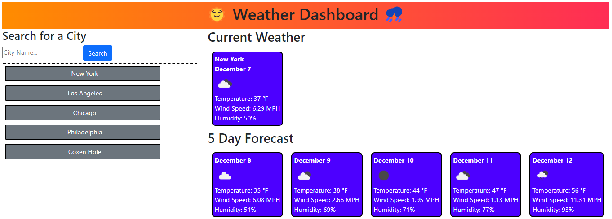

# Five Day Weather Forecast
 This app will allow you to enter the name of a city and display weather forecast information for the current day and the next five days after. It will provide information about temperature, wind speed, and humidity.

## Purpose
Build a weather dashboard that will run in the browser and feature dynamically updated HTML and CSS

## Deployed Webpage Link
https://jabrams513.github.io/five-day-weather-forecast/

## User Story

AS A traveler

I WANT to see the weather outlook for multiple cities

SO THAT I can plan a trip accordingly

## Acceptance Criteria

GIVEN a weather dashboard with form inputs

WHEN I search for a city

THEN I am presented with current and future conditions for that city and that city is added to the search history

WHEN I view current weather conditions for that city

THEN I am presented with the city name, the date, an icon representation of weather conditions, the temperature, the humidity, and the wind speed

WHEN I view future weather conditions for that city

THEN I am presented with a 5-day forecast that displays the date, an icon representation of weather conditions, the temperature, the wind speed, and the humidity

WHEN I click on a city in the search history

THEN I am again presented with current and future conditions for that city

## Screenshot
Please refer to the following screenshot as a reference for the web application's appearance and functionality:

## Code Sources and Collaborators
I had the opportunity to collaborate with my peers Kenny, Mykhailo, Ryan, Gelu, and Mustapha. We checked our work with one another.

In addition, I received feedback from my instructor, Diego, my TA, Andrew, as well as my tutor, Corey.

All code used was self-generated or otherwise gathered from class materials.
